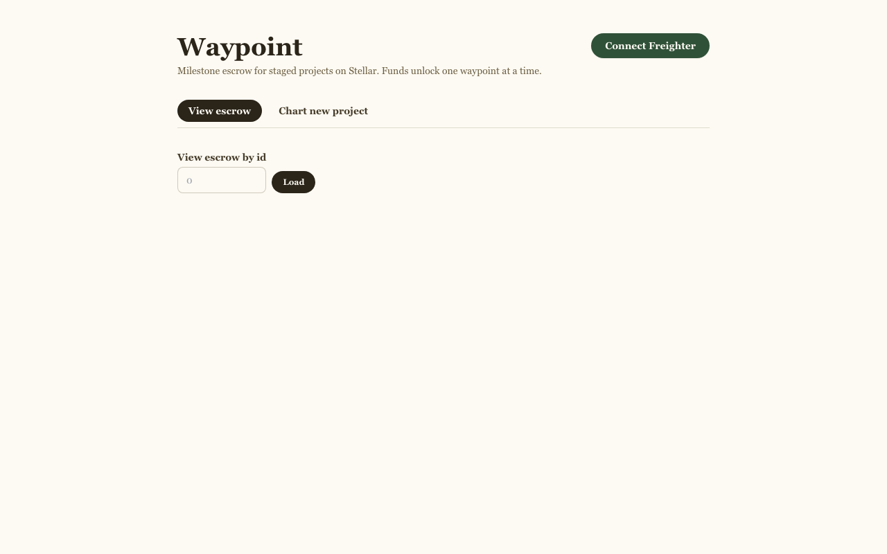
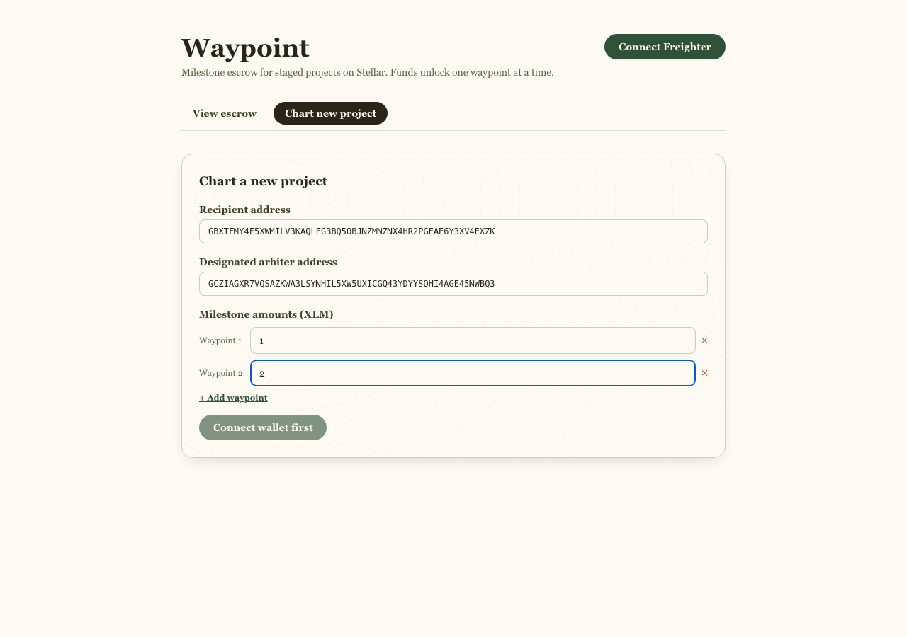
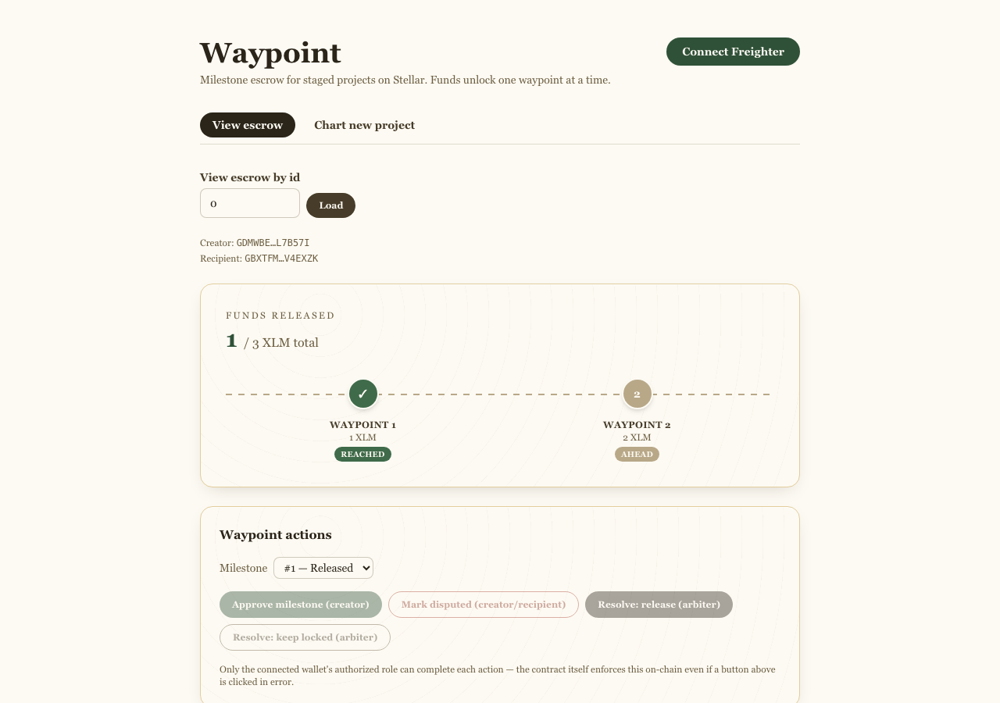
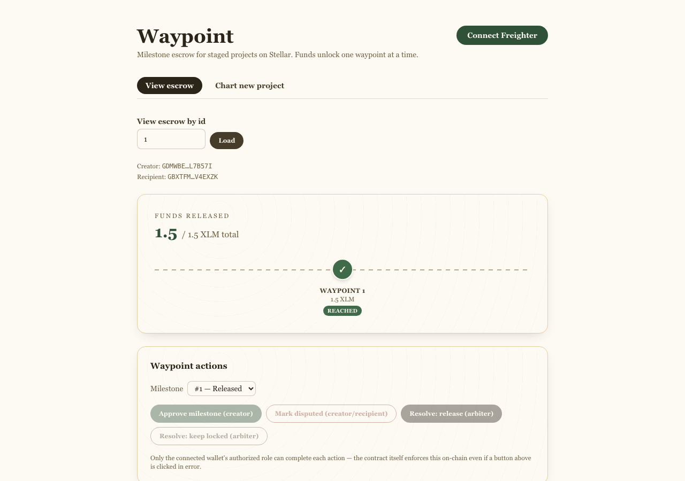
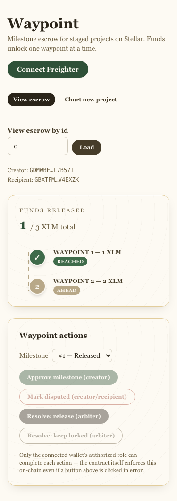

# Waypoint — Milestone Escrow

A creator locks funds for a project in stages. Instead of releasing everything at once, funds
unlock **milestone by milestone** as each stage is approved. If a milestone is disputed, a
designated arbiter resolves it rather than the funds being stuck or auto-released.

Built for the Stellar dApp Challenge, Level 3, on Soroban + Next.js.

## 1. Project Description

Waypoint is a three-contract escrow system for staged projects:

- **`escrow`** holds custody of funds and milestone state (`Locked` / `Released` / `Disputed`).
- **`arbiter`** owns the decision logic: normal-path approval by the project creator, and
  dispute resolution by a designated per-escrow arbiter address.
- The native **XLM Stellar Asset Contract (SAC)** is the settlement token — no redundant custom
  token contract was written.

The frontend's hero element is a **trail-map milestone stepper**: one "waypoint" pin per
milestone, connected by a dotted trail, colored by status, with a live funds-released counter
that updates via polling as milestones move through the chain.

## 2. Setup Instructions

### Contracts

```bash
# from the repo root
rustup target add wasm32v1-none   # see "Known Limitations" for why not wasm32-unknown-unknown
cargo test --workspace
cargo build --target wasm32v1-none --release -p waypoint-escrow
cargo build --target wasm32v1-none --release -p waypoint-arbiter
```

Deploy (testnet, escrow first since arbiter's constructor needs its address):

```bash
stellar keys generate waypoint-deployer --network testnet --fund

stellar contract deploy \
  --wasm target/wasm32v1-none/release/waypoint_escrow.wasm \
  --source waypoint-deployer --network testnet \
  -- --token <NATIVE_SAC_ADDRESS>

stellar contract deploy \
  --wasm target/wasm32v1-none/release/waypoint_arbiter.wasm \
  --source waypoint-deployer --network testnet \
  -- --escrow_contract <ESCROW_ADDRESS>
```

The native SAC address for a given network can be looked up with
`stellar contract id asset --asset native --network testnet`.

### Frontend

```bash
cd frontend
cp .env.local.example .env.local   # fill in your deployed contract addresses
npm ci
npm run dev      # local dev server
npm run build    # static export to frontend/out (output: 'export')
```

## 3. Architecture

```
                 ┌────────────────────┐
   creator ───▶  │   escrow contract  │ ◀── holds funds, milestone state
                 │  (custody + state) │
                 └─────────┬──────────┘
                            │ release_milestone (arbiter-contract-gated)
                            ▼
                 ┌────────────────────┐        ┌──────────────────────┐
   creator/      │  arbiter contract  │ ──────▶ │ native XLM SAC token │
   designated ──▶│ (approve/resolve)  │ invoke  │  (transfer)          │
   arbiter       └────────────────────┘         └──────────────────────┘
```

| Contract | Address (Stellar Testnet) | Stellar Expert |
|---|---|---|
| escrow | `CDE64MRDFC5HN3TXL63VOCZOSC3UXYG2MI2X3JXQXLR3OJYBY6MY6GPE` | [view](https://stellar.expert/explorer/testnet/contract/CDE64MRDFC5HN3TXL63VOCZOSC3UXYG2MI2X3JXQXLR3OJYBY6MY6GPE) |
| arbiter | `CALIVYUP5R7NWDHSYZO6BP3HG7DUSKAL553CWOHKDPHRVYKZDAWIJ7KK` | [view](https://stellar.expert/explorer/testnet/contract/CALIVYUP5R7NWDHSYZO6BP3HG7DUSKAL553CWOHKDPHRVYKZDAWIJ7KK) |
| native XLM SAC (token) | `CDLZFC3SYJYDZT7K67VZ75HPJVIEUVNIXF47ZG2FB2RMQQVU2HHGCYSC` | [view](https://stellar.expert/explorer/testnet/contract/CDLZFC3SYJYDZT7K67VZ75HPJVIEUVNIXF47ZG2FB2RMQQVU2HHGCYSC) |

Full deployment log (identities, both end-to-end flows, all 9 transaction hashes) is in
[`deployment-evidence.md`](./deployment-evidence.md).

## 4. Inter-Contract Calls

Every milestone payout goes through the same real, on-chain call chain — never simulated or
mocked:

```
arbiter.approve_milestone()  or  arbiter.resolve_dispute(approve: true)
    │  env.invoke_contract::<Escrow>(&escrow_addr, "get_escrow", ...)   [read state]
    │  env.invoke_contract::<bool>(&escrow_addr, "release_milestone", ...)
    ▼
escrow.release_milestone()
    │  escrow.arbiter_contract.require_auth()   [only the registered arbiter contract may call]
    │  env.invoke_contract::<()>(&token, "transfer", ...)
    ▼
native XLM SAC transfer(escrow_contract → recipient, amount)
```

`escrow.release_milestone` calls `Address::require_auth()` on the escrow's registered
`arbiter_contract` address. Soroban's auth model treats a contract address's `require_auth` as
satisfied only when that contract is the direct cross-contract invoker — there's no signature to
forge, so a top-level client call or a call from any other contract fails authorization. This is
proven by test 4 (`release_milestone_direct_call_fails`) and by the real testnet transaction
below.

**Real transaction exercising the full chain:**
`bc4d8f77636c05b36041c5cb497eaf0061606958ea7f8e07d94f901a0300fa07` — an `approve_milestone` call
whose ledger events show, in order: a `transfer` event from the native SAC, a `released` event
from `escrow`, and an `approved` event from `arbiter`. See
[`deployment-evidence.md`](./deployment-evidence.md) for the raw event log and a second example
via the dispute path.

## 5. Smart Contract Deployment Workflow

1. `cargo test --workspace` — 6 tests must pass (see Section 8).
2. `cargo build --target wasm32v1-none --release` for both `escrow` and `arbiter`.
3. Fund a deployer identity via Friendbot: `stellar keys generate <name> --network testnet --fund`.
4. Deploy `escrow` first, passing the native SAC address as its constructor arg.
5. Deploy `arbiter` second, passing the deployed `escrow` address as its constructor arg.
6. Wire both addresses into `frontend/.env.local` as `NEXT_PUBLIC_ESCROW_CONTRACT_ADDRESS` /
   `NEXT_PUBLIC_ARBITER_CONTRACT_ADDRESS` (and into Cloudflare's dashboard before any static
   build, since `NEXT_PUBLIC_*` values are baked in at build time).
7. Run both representative flows once to confirm the deployment is live (see
   `deployment-evidence.md`).

This was executed for real on Stellar Testnet — see Section 3 for the resulting addresses.

## 6. Error Handling & Loading States

Four distinct, deliberately-triggerable error states, beyond the standard three:

1. **Wallet not found** — `isFreighterAvailable()` checks before every connect attempt; if
   Freighter isn't installed, the UI shows an inline banner instead of a raw exception
   ([`lib/wallet.ts`](./frontend/lib/wallet.ts)).
2. **Signature rejected** — both wallet connection and transaction signing catch a user
   rejection from Freighter and surface it as a named error state, not a console-only failure.
3. **Insufficient balance** — checked client-side in `CreateEscrowForm` before any transaction is
   built (comparing the wallet's live XLM balance against the milestone total), and again
   server-side by classifying simulation failures that mention balance/insufficient funds.
4. **Not authorized** — every action button in `ActionPanel` is disabled client-side unless the
   connected wallet matches the required role (creator for approve, creator/recipient for
   dispute); any case the client-side check doesn't catch — including a mismatched *designated
   arbiter* on `resolve_dispute`, which the client can't check locally because that address lives
   inside the arbiter contract's per-escrow storage, not in the `Escrow` struct itself — is still
   caught from the on-chain simulation and surfaced as the same error state.

Loading states: `EscrowViewer` shows "Reading escrow #N…" during the initial read, and every
write action's button label switches to a busy state ("Approving…", "Funding…", etc.) for the
duration of the simulate → sign → submit → confirm round trip.

## 7. Mobile Responsive Frontend

Verified manually at 320px, 375px, 768px, and desktop widths (screenshots in Section 10). The
milestone stepper — the hero element — genuinely changes layout below 480px: a horizontal trail
with pins side-by-side becomes a vertical trail with pins stacked top-to-bottom, not just a
shrunk version of the same layout (see `MilestoneStepper.tsx`, the `min-[480px]:block` /
`min-[480px]:hidden` pair). The create-escrow form's inputs go full-width and stack at narrow
widths, and the top nav pills stay single-line at 320px (`whitespace-nowrap` + a smaller mobile
type scale).

## 8. Tests

6 tests, all passing, exercising both contracts together against a locally registered native SAC
so balance deltas are asserted for real:

```
running 6 tests
test test::create_escrow_stores_milestones_locked ... ok
test test::release_milestone_direct_call_fails - should panic ... ok
test test::fund_escrow_rejects_mismatched_amount - should panic ... ok
test test::release_milestone_via_arbiter_pays_recipient ... ok
test test::double_release_fails - should panic ... ok
test test::dispute_then_resolve_approve_pays_out ... ok

test result: ok. 6 passed; 0 failed; 0 ignored; 0 measured; 0 filtered out; finished in 0.14s
```

| Test | What it proves |
|---|---|
| `create_escrow_stores_milestones_locked` | Milestone amounts and `Locked` status are stored correctly for all milestones. |
| `fund_escrow_rejects_mismatched_amount` | `fund_escrow` panics if the funder can't cover the exact milestone-amount sum (there's no separate amount argument to mismatch by design — see the test's doc comment). |
| `release_milestone_via_arbiter_pays_recipient` | A release via the registered arbiter contract moves the exact milestone amount to the recipient (asserted via balance delta). |
| `release_milestone_direct_call_fails` | Calling `release_milestone` directly (not via the arbiter contract) panics — proves the access control is real, not decorative. |
| `dispute_then_resolve_approve_pays_out` | `mark_disputed` → `resolve_dispute(approve: true)` transitions `Disputed → Released` and pays out. |
| `double_release_fails` | A second `approve_milestone` on an already-`Released` milestone panics — no double-payout. |

Reproduce with `cargo test --workspace`.

## 9. CI/CD Pipeline

`.github/workflows/ci.yml` defines two jobs: `contracts` (`cargo test --workspace`, then a
`wasm32v1-none` release build of each contract) and `frontend` (`npm run lint`, `npm run build`).

**PENDING** — a green Actions run screenshot: this repository was built locally in this session
and has not yet been pushed to a GitHub remote, so no Actions run has executed yet. Push to
GitHub and the workflow will run automatically on the first push to `main`; a screenshot of that
green run should replace this note.

## 10. Screenshots

All captured from a real local static-export build (`npm run build` → `next start`-equivalent
static serve) against the live testnet contracts above — no mocked data.

| | |
|---|---|
| Home / view escrow |  |
| Milestone creation |  |
| Funded state, stepper mid-progress (real escrow #0, 1/3 XLM released) |  |
| Dispute flow, fully resolved (real escrow #1, disputed then released) |  |
| Mobile view, vertical trail (375px) |  |

**PENDING** — a "wallet connected" screenshot: this build environment doesn't have the Freighter
browser extension installed, so the connect flow couldn't be exercised against a real extension
in a screenshot. The connect/disconnect code path itself (`lib/wallet.ts`,
`components/WalletButton.tsx`) is implemented and was reviewed manually; testing it end-to-end
requires a browser with Freighter installed and a funded testnet account.

## 11. Live Demo Link

**PENDING** — no Cloudflare Workers deployment has been performed in this session (that requires
a Cloudflare account and dashboard access this environment doesn't have). `wrangler.toml` is
configured per Section 8 of the build spec; running `wrangler deploy` from a machine with
Cloudflare credentials, after setting the `NEXT_PUBLIC_*` env vars in the dashboard, will produce
a live URL to place here.

## 12. Demo Video

**PENDING** — no screen-recording capability is available in this environment. The screenshots in
Section 10, taken against the real deployed testnet contracts, are the closest available
evidence; a 1–2 minute walkthrough recording should be added before final submission.

## 13. Production-Ready Architecture Practices

- **No floating point anywhere** — all amounts are `i128` stroops; milestone sums use
  `checked_add` and panic on overflow rather than silently wrapping.
- **Explicit `Address::require_auth()`** everywhere authorization matters — never inferred from
  an invoker address or a client-supplied flag.
- **Contract-to-contract authorization is real**: `release_milestone` is gated by
  `require_auth()` on the *registered arbiter contract's own address*, which Soroban only
  satisfies when that contract is the direct invoker — verified by a dedicated test that
  disables auth mocking (`test::release_milestone_direct_call_fails`) and by a real testnet call
  chain (Section 4).
- **State flips before external calls**: `release_milestone` sets `Released` status before
  invoking the token transfer, so a reentrant call hits the `AlreadyReleased` guard.
- **Read-only reads need no wallet**: `get_escrow` simulations use a deterministic, unfunded,
  never-signed keypair as the source account, so viewing an escrow's state doesn't require a
  connected wallet.
- **Static export + edge deployment**: the frontend has no server-side runtime dependency
  (`output: 'export'`), matching the Cloudflare Workers static-assets deployment target.
- **Client-side role gating precedes every transaction**, but the contract's own checks are the
  actual source of truth — the UI never trusts itself.

## 14. Known Limitations / PENDING Items

- **`wasm32-unknown-unknown` vs `wasm32v1-none`**: this build environment's Rust toolchain
  (1.96) enables `reference-types`/`multi-value` WASM features by default that the Soroban
  environment doesn't yet support under the `wasm32-unknown-unknown` target, so contracts here
  are built with `wasm32v1-none` instead (the SDK-recommended replacement). Both contracts were
  deployed successfully to testnet from this build, confirming the resulting wasm is fully valid
  and deployable.
- **No refund path on dispute rejection**: `resolve_dispute(approve: false)` intentionally leaves
  the milestone `Disputed` with funds locked in escrow, exactly as the spec requires ("no fake
  refund path unless you also implement one"). A real refund path (e.g. returning funds to the
  creator) was out of scope for this build.
- **GitHub Actions has not run yet** — no green CI screenshot (Section 9) until this repo is
  pushed to a GitHub remote.
- **No live Cloudflare deployment** — no live demo URL (Section 11) until `wrangler deploy` is
  run with real Cloudflare credentials.
- **No demo video** — this environment has no screen-recording capability (Section 12).
- **No "wallet connected" screenshot** — this environment has no Freighter browser extension
  installed (Section 10).
- **`npm audit` reports vulnerabilities** in transitive dependencies pulled in by
  `@creit.tech/stellar-wallets-kit` (mostly other wallet SDKs it optionally supports). None are
  in code paths this app actually exercises (Freighter only), but they haven't been individually
  triaged.
